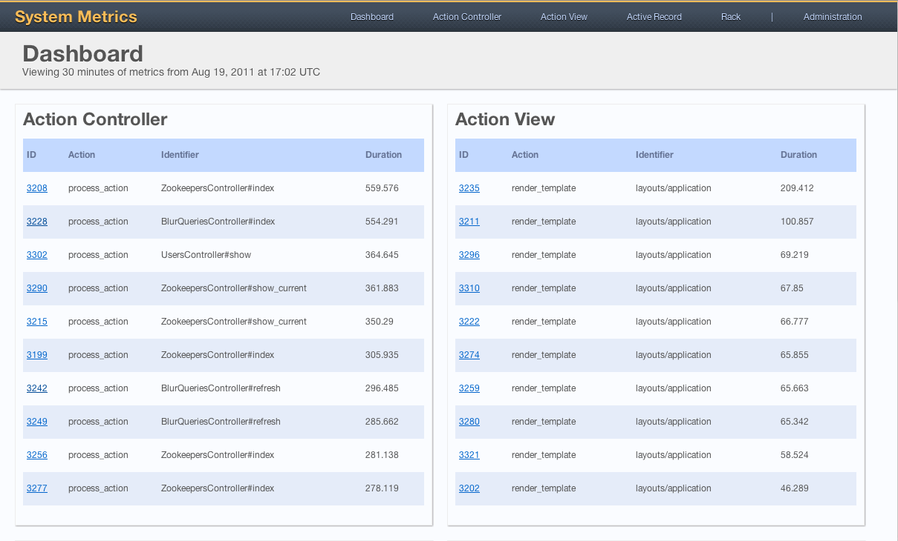
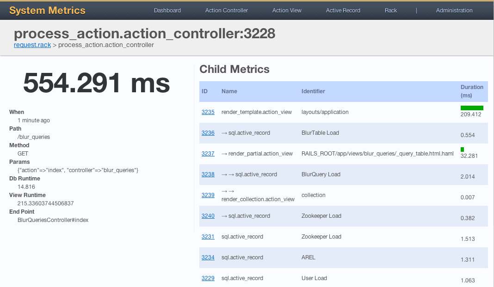
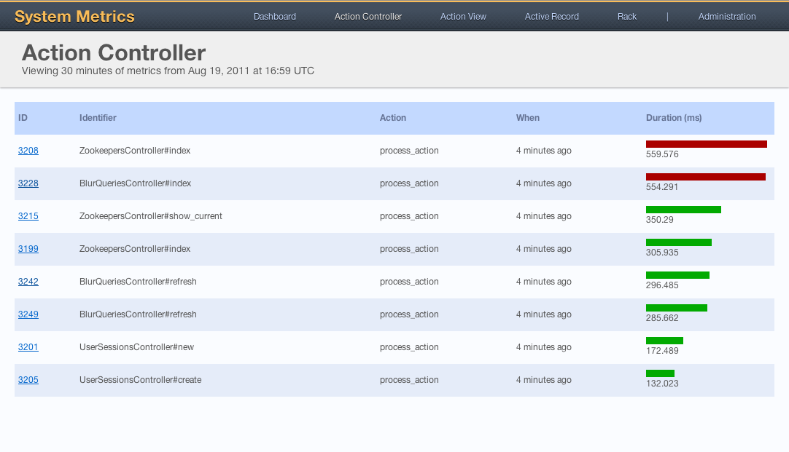

Dashboard View
--------------
The dashboard shows your ten slowest metrics from each category. The
categories also happen to be the menu options along the top of the
screen. Clicking the id number of any metric takes you to its detail
screen.

Metric Details View
-------------------
The metric details screen shows a number of things. Starting near the
top you'll see the metric name followed by a unique id number for the
metric. Immediately below that is a clickable trail for any parent
metrics. The large number is the total time elapsed during the
collection of the metric, which includes the child metrics shown in the
table to the right. Below the large elapsed time number is a list of
all the metric payload data collected.

Metric Category View
--------------------
The metric category simply displays all metrics within the category for
the given time range, sorted slowest to fastest. Please see the <a
href="documentation.html">documentation</a> for details on how to change
the data/time range displayed.

